### LAMBDA表达式

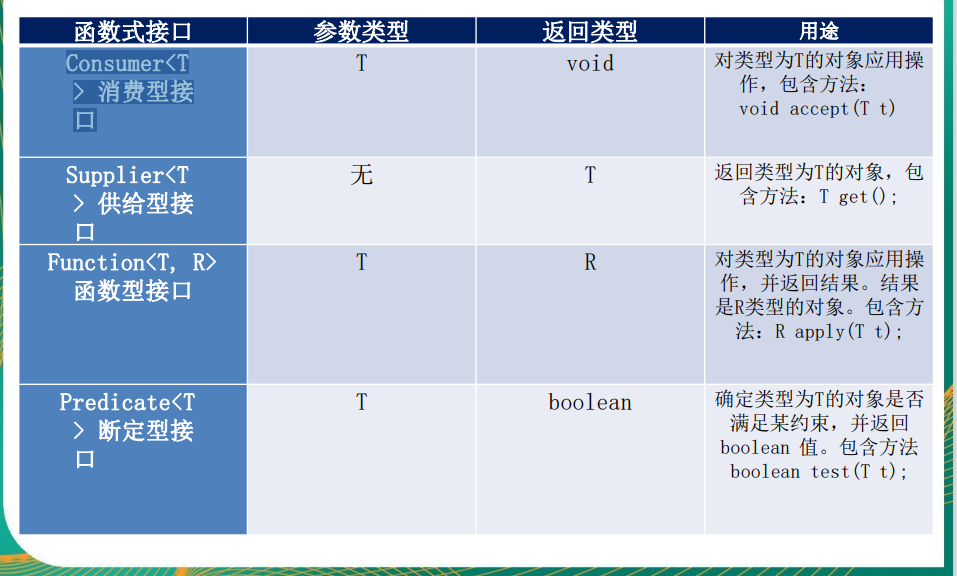

```java
    public void test(){
        /*
        * Consumer 消费型
        * parameter T
        * return void
        * */
        Consumer<String> consumer = System.out::println;
        consumer.accept("hello word");
        
        /*
        * Supplier 供给型
        * parameter null
        * return T
        * */
        Date date = new Date();
        Supplier<Long> stringSupplier = date::getTime;
        System.out.println("stringSupplier.get() = " + stringSupplier.get());
        /*
         * Function 函数型
         * parameter T
         * return R
         * */
        SimpleDateFormat format = new SimpleDateFormat("yyyy-MM-dd");
        Function<Date,String> function = format::format;
        System.out.println(function.apply(new Date()));

        /*
         * BiPredicate 断定型
         * parameter <T, U>
         * return boolean
         * */
        BiPredicate<String,String> predicate = String::equals;
        System.out.println(predicate.test("aa","aa"));
    }
```

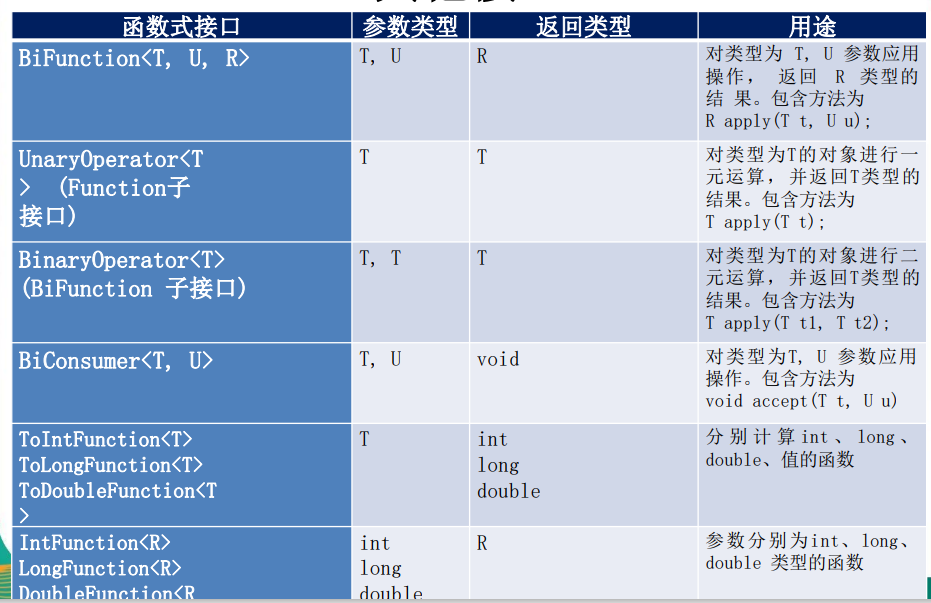

### 方法引用

1. 对象::实例方法
2. 对象::实例方法
3. 类::实例方法

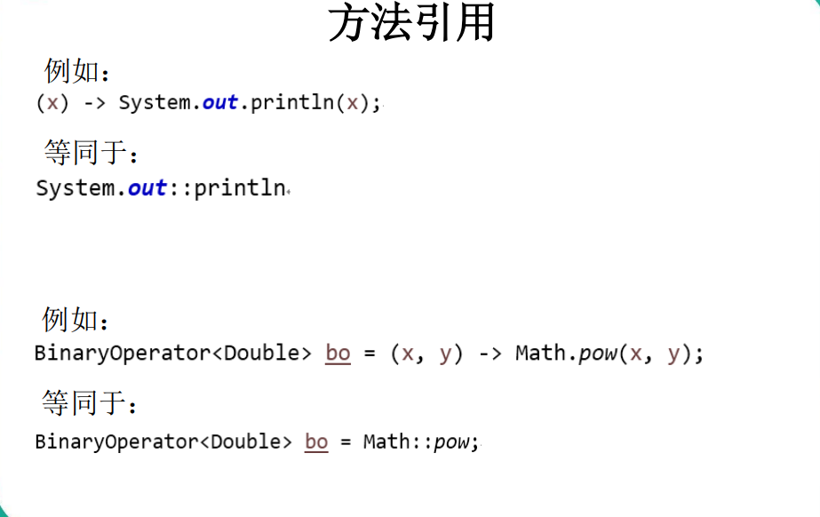

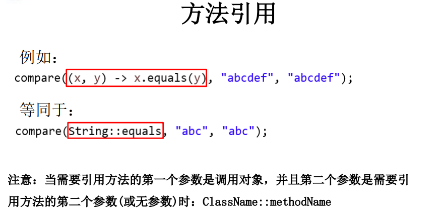

### 强大的Stream API

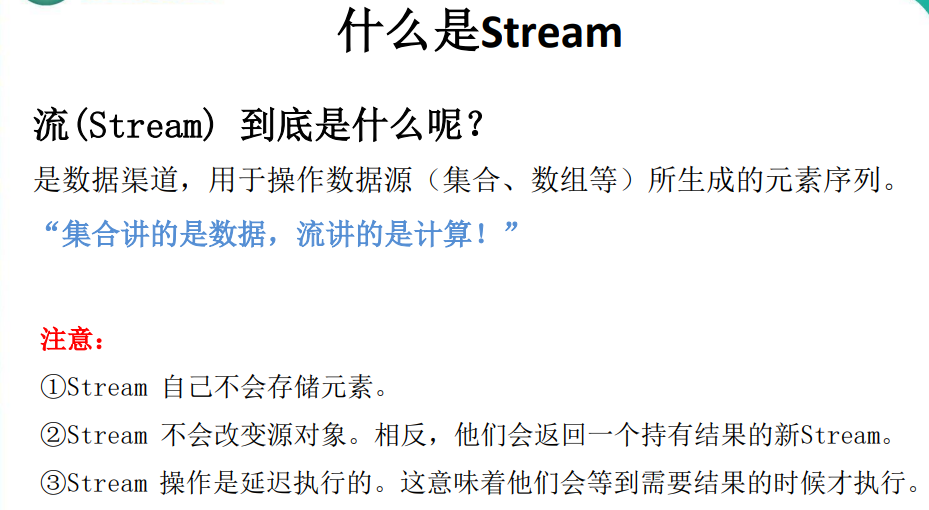

#### Stream 的操作三个步骤

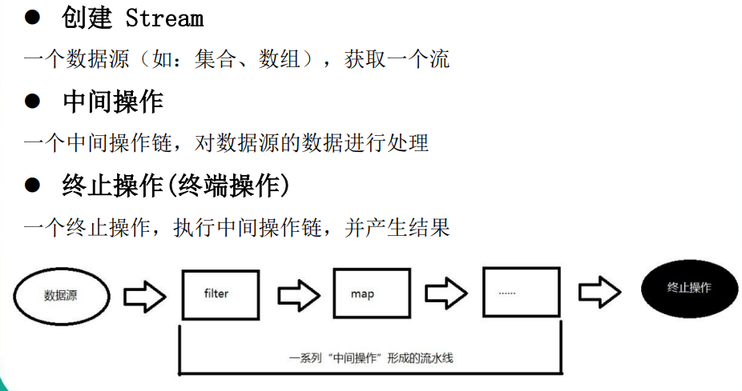

#### 创建Stream

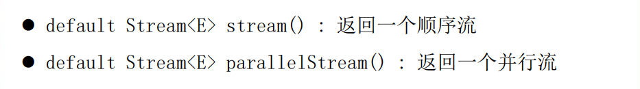

#### Stream 的中间操作

##### 创建流

```java
@Test
    public void createStream(){
        //1. Collection 提供了两个方法  stream() 与 parallelStream()
        List<String> list = new ArrayList<>();
        Stream<String> stream = list.stream(); //获取一个顺序流
        Stream<String> parallelStream = list.parallelStream(); //获取一个并行流

        //2. 通过 Arrays 中的 stream() 获取一个数组流
        Integer[] nums = new Integer[10];
        Stream<Integer> stream1 = Arrays.stream(nums);

        //3. 通过 Stream 类中静态方法 of()
        Stream<Integer> stream2 = Stream.of(1,2,3,4,5,6);

        //4. 创建无限流
        //迭代
        Stream<Integer> stream3 = Stream.iterate(0, (x) -> x + 2).limit(10);
        stream3.forEach(System.out::println);

        //生成
        Stream<Double> stream4 = Stream.generate(Math::random).limit(2);
        stream4.forEach(System.out::println);
    }
```

```java
/*
    * 全局变量
    * */
    List<Employee> emps = Arrays.asList(
            new Employee(102, "李四", 59, 6666.66),
            new Employee(101, "张三", 18, 9999.99),
            new Employee(103, "王五", 28, 3333.33),
            new Employee(104, "赵六", 8, 7777.77),
            new Employee(104, "赵六", 8, 7777.77),
            new Employee(104, "赵六", 8, 7777.77),
            new Employee(105, "田七", 38, 5555.55)
    );
```

##### 映射

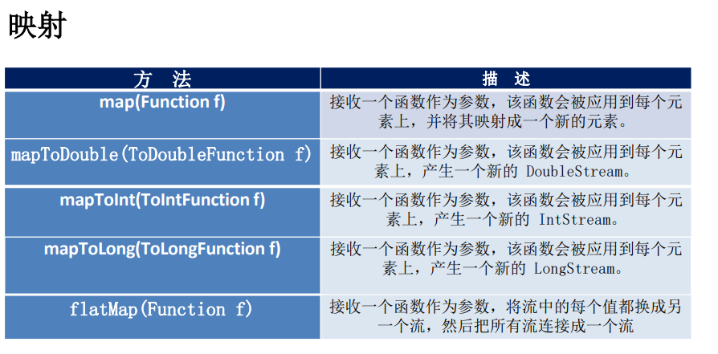

```
    @Test
    public void map(){
        /*
        * map 映射
        * parameter FUNCTION
        * */
        List<String> collect1 = emps.stream()
                .map(employee -> employee.getName())
                .collect(Collectors.toList()); //将结果转成 list
        collect1.forEach(System.out::println);
        System.out.println("-------------------------------------------");
        List<String> collect2 = emps.stream()
                .map(Employee::getName)
                .collect(Collectors.toList());
        collect2.forEach(System.out::println); //将结果转成 list
        
    }
```

```java
    @Test
    public void flatmap(){
        /*
         * flatmap 映射
         * parameter FUNCTION
         * 相当于 将list中的每个元素取出来 放到另一个list中
         * */
        List<List<String>> list = Arrays.asList(
                Arrays.asList("1", "2", "3", "4", "5"),
                Arrays.asList("6", "7", "8", "9", "10")
        );
        List<String> collect1 = list.stream()
                .flatMap(s->s.stream()) //s相当于遍历的 item
                .collect(Collectors.toList());
        System.out.println(collect1);  //[1, 2, 3, 4, 5, 6, 7, 8, 9, 10]
        System.out.println("---------------------------------------------");
        List<String> collect = list.stream()
                .flatMap(List::stream)
                .collect(Collectors.toList());
        System.out.println(collect);  //[1, 2, 3, 4, 5, 6, 7, 8, 9, 10]

    }
```

##### 排序

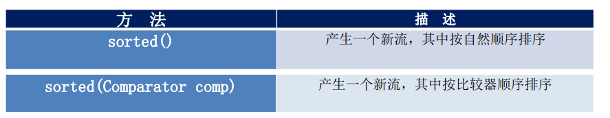

```Java
    @Test
    public void sorted(){
        /*自然顺序排序*/
        List<Integer> collect = emps.stream()
                .map(Employee::getAge)
                .sorted()
                .collect(Collectors.toList());
        System.out.println(collect); //[8, 8, 8, 18, 28, 38, 59]
        System.out.println("------------------------------------");
        /*比较器顺序排序*/
        List<Employee> collect1 = emps.stream()
                .sorted((x, y) -> {
                    if (x.getAge() == y.getAge()) {
                        return x.getName().compareTo(y.getName());
                    } else {
                        return Integer.compare(x.getAge(), y.getAge());
                    }
                }).collect(Collectors.toList());
        System.out.println(collect1);

    }
```

##### Stream 的终止操作

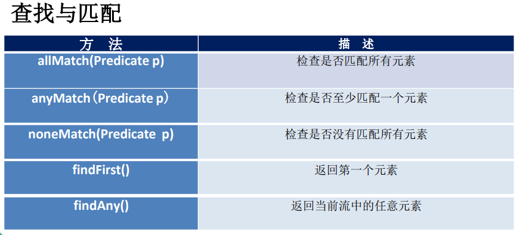

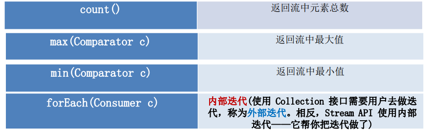

```java
    @Test
    public void end(){
        /*allMatch*/
        boolean b = emps.stream()
                .allMatch(e -> e.getStatus().equals(Employee.Status.上班));
        System.out.println("是否全部上班 = " + b); //是否全部上班 = false
        /*anyMatch*/
        boolean b1 = emps.stream()
                .anyMatch(e -> e.getStatus().equals(Employee.Status.上班));
        System.out.println("是否有人上班 = " + b1); //是否有人上班 = true
        /*max*/
        Optional<Double> max = emps.stream()
                .map(Employee::getSalary)
                .max(Double::compare);
        System.out.println(max.get()); //9999.99
        /*reduce*/
        Optional<Integer> reduce = emps.stream()
                .map(Employee::getAge)
                .reduce(Integer::sum);
        System.out.println(reduce.get()); //167

    }
```

##### 收集

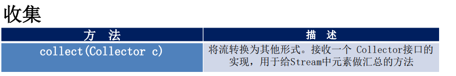

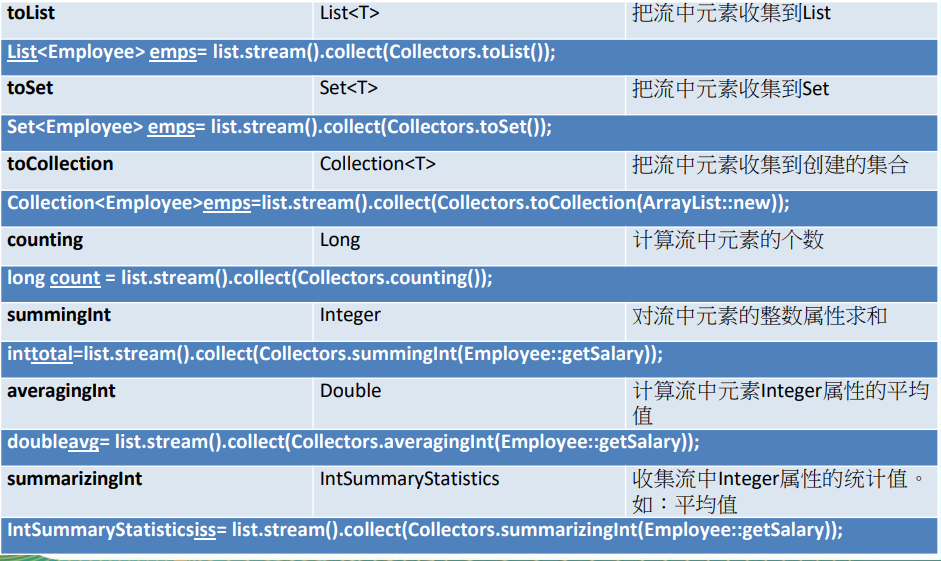

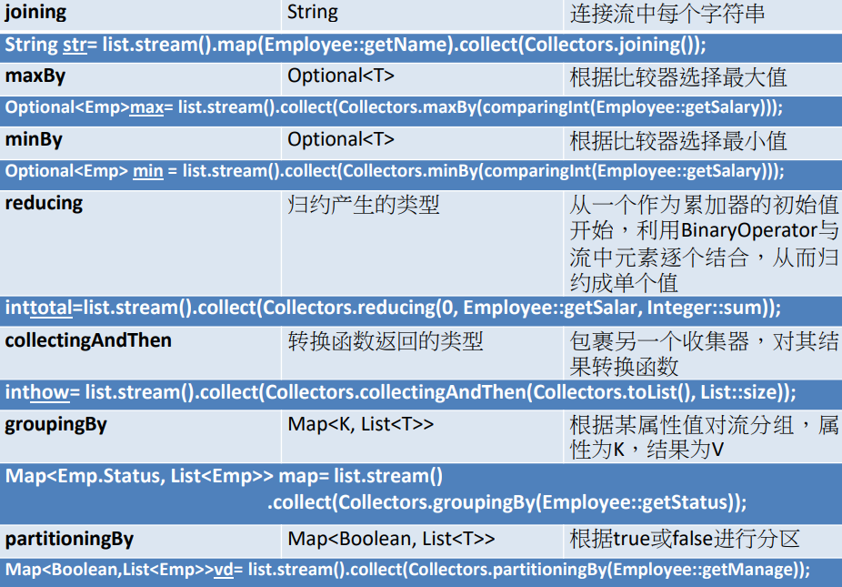

```java
    @Test
    public void collect(){

        List<String> list = emps.stream()
                .map(Employee::getName)
                .collect(Collectors.toList());
        System.out.println(list);//[李四, 张三, 王五, 赵六, 张三, 赵六, 田七]
        System.out.println("----------------------------------");
        /*
        * 获取相同年龄的姓名
        *
        * */

        Map<Integer, Set<String>> collect = emps.stream()
                .collect(Collectors.groupingBy(Employee::getAge,
                        Collectors.mapping(Employee::getName,
                                Collectors.toSet())));
        System.out.println(collect); 
        // {18=[张三], 38=[田七], 8=[张三, 赵六], 59=[李四], 28=[王五]}


    }
```

## 小测

```Java
public class TestsTreamAPI {
    List<Transaction> transactions = null;

    @Before
    public void before(){
        Trader raoul = new Trader("Raoul", "Cambridge");
        Trader mario = new Trader("Mario", "Milan");
        Trader alan = new Trader("Alan", "Cambridge");
        Trader brian = new Trader("Brian", "Cambridge");

        transactions = Arrays.asList(
                new Transaction(brian, 2011, 300),
                new Transaction(raoul, 2012, 1000),
                new Transaction(raoul, 2011, 400),
                new Transaction(mario, 2012, 710),
                new Transaction(mario, 2012, 700),
                new Transaction(alan, 2012, 950)
        );
    }

    //1. 找出2011年发生的所有交易， 并按交易额排序（从低到高）
    @Test
    public void test1(){
        transactions.stream()
                .filter(transaction -> transaction.getYear()==2011)
                .sorted((x,y)->Integer.compare(x.getValue(),y.getValue()))
                .forEach(System.out::println);
    }
    //2. 交易员都在哪些不同的城市工作过？
    @Test
    public void test2(){
        Map<String, List<String>> collect = transactions.stream()
                .map(Transaction::getTrader)
                .collect(Collectors.groupingBy(Trader::getName,
                        Collectors.mapping(Trader::getCity,
                                Collectors.toList())));
        System.out.println(collect);
        //{Brian=[Cambridge], Raoul=[Cambridge, Cambridge], Alan=[Cambridge], Mario=[Milan, Milan]}
    }
    //3. 查找所有来自剑桥的交易员，并按姓名排序
    @Test
    public void test3(){
        transactions.stream()
                .filter((t) -> t.getTrader().getCity().equals("Cambridge"))
                .map(Transaction::getTrader)
                .sorted((t1, t2) -> t1.getName().compareTo(t2.getName()))
                .distinct()
                .forEach(System.out::println);
        //Trader(name=Alan, city=Cambridge)
        //Trader(name=Brian, city=Cambridge)
        //Trader(name=Raoul, city=Cambridge)
    }
    
    //5. 有没有交易员是在米兰工作的？
    @Test
    public void test5(){
        boolean bl = transactions.stream()
                .anyMatch((t) -> t.getTrader().getCity().equals("Milan"));

        System.out.println(bl);
    }

    //6. 打印生活在剑桥的交易员的所有交易额
    @Test
    public void test6(){
        Optional<Integer> sum = transactions.stream()
                .filter((e) -> e.getTrader().getCity().equals("Cambridge"))
                .map(Transaction::getValue)
                .reduce(Integer::sum);

        System.out.println(sum.get());
    }


    //7. 所有交易中，最高的交易额是多少
    @Test
    public void test7(){
        Optional<Integer> max = transactions.stream()
                .map((t) -> t.getValue())
                .max(Integer::compare);

        System.out.println(max.get());
    }

    //8. 找到交易额最小的交易
    @Test
    public void test8(){
        Optional<Transaction> op = transactions.stream()
                .min((t1, t2) -> Integer.compare(t1.getValue(), t2.getValue()));

        System.out.println(op.get());
    }
}
```

